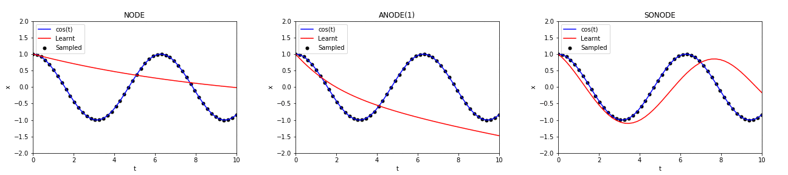
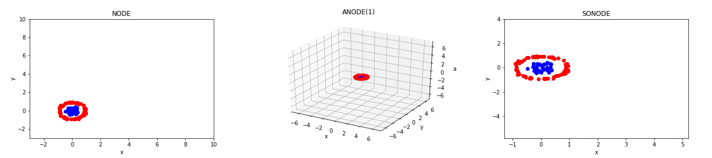
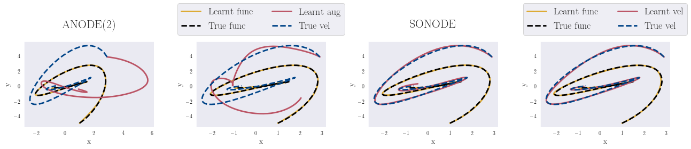
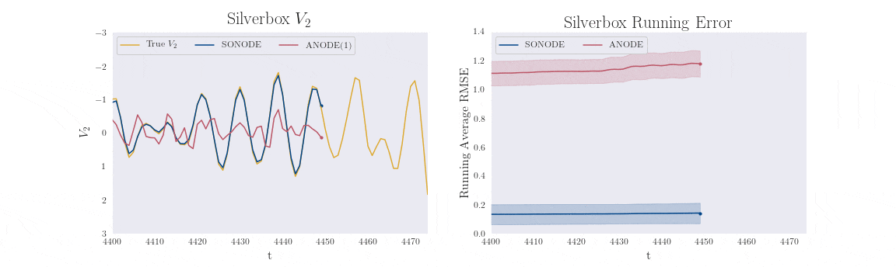

# On Second Order Behaviour in Augmented Neural ODEs 
[](https://github.com/a-norcliffe/sonode/blob/master/LICENSE) [](https://www.python.org/downloads/release/python-370/)

Official code for the paper [**On Second Order Behaviour in Augmented Neural ODEs**](http://arxiv.org/abs/2006.07220)
 ([Alexander Norcliffe](https://twitter.com/alexnorcliffe98), 
 [Cristian Bodnar](https://crisbodnar.github.io/), 
 [Ben Day](https://www.cl.cam.ac.uk/~bjd39/), 
 [Nikola Simidjievski](https://simidjievskin.github.io/),
  [Pietro Liò](https://www.cl.cam.ac.uk/~pl219/))
  
  
  
 

**Please note:** This is research code which is no longer maintained, there may be new issues. I plan to update it to be easier to run in June 2022.

## Abstract 

Neural Ordinary Differential Equations (NODEs) are a new class of models that transform data continuously through 
infinite-depth architectures. The continuous nature of NODEs has made them particularly suitable for learning the
dynamics of complex physical systems. While previous work has mostly been focused on first order ODEs, the dynamics of 
many systems, especially in classical physics, are governed by second order laws. In this work, we take a closer look 
at Second Order Neural ODEs (SONODEs). We show how the adjoint sensitivity method can be extended to SONODEs and prove 
that an alternative first order optimisation method is computationally more efficient. Furthermore, we extend the 
theoretical understanding of the broader class of Augmented NODEs (ANODEs) by showing they can also learn higher order 
dynamics, but at the cost of interpretability. This indicates that the advantages of ANODEs go beyond the extra space 
offered by the augmented dimensions, as originally thought. Finally, we compare SONODEs and ANODEs on synthetic and 
real dynamical systems and demonstrate that the inductive biases of the former generally result in faster training 
and better performance. 



*ANODEs and SONODEs successfully learn the trajectory in real space of a 2D ODE for two different random initialisations. 
However, the augmented trajectories of ANODE are in both cases widely different from the true velocity of the ODE. 
In contrast, SONODE converges in both cases to the true ODE.*

## Getting started

We used `python 3.7` for this project. To setup the virtual environment and necessary packages, please run the following commands:
```bash
$ conda create -n sonode python=3.7
$ conda activate sonode
$ pip install -r requirements.txt
```
You will also need to install `PyTorch 1.4.0` from the [official website](https://pytorch.org/).

## Running the code




We provide a `run.sh` script for each experiment in the `experiments` folder. 
All programs other than the MNIST experiments can be run on a cpu and typically finish within 2 hours 
depending on the machine. 

## Citation
For attribution in academic contexts, please cite this work as
```
@inproceedings{norcliffe2020_sonode,
  title={On Second Order Behaviour in Augmented Neural ODEs},
  author={Alexander Norcliffe and Cristian Bodnar and Ben Day and Nikola Simidjievski and Pietro Li{\`o}},
  booktitle = {Advances in Neural Information Processing Systems},
  year={2020}
}
```


